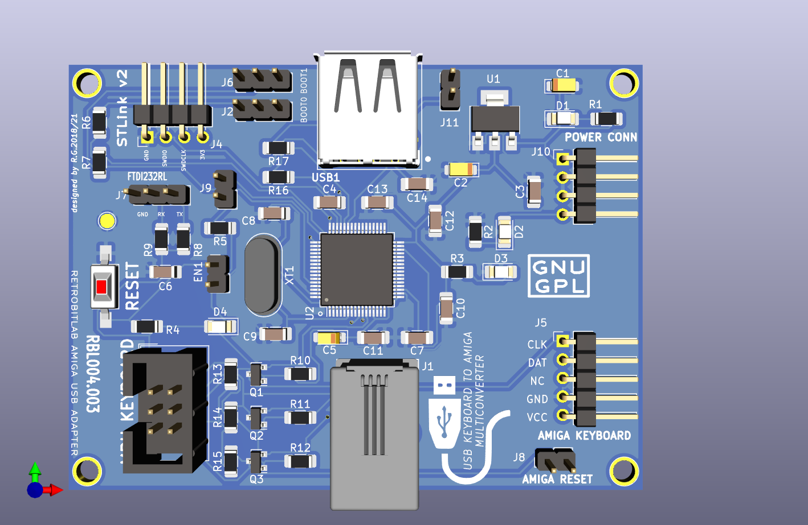
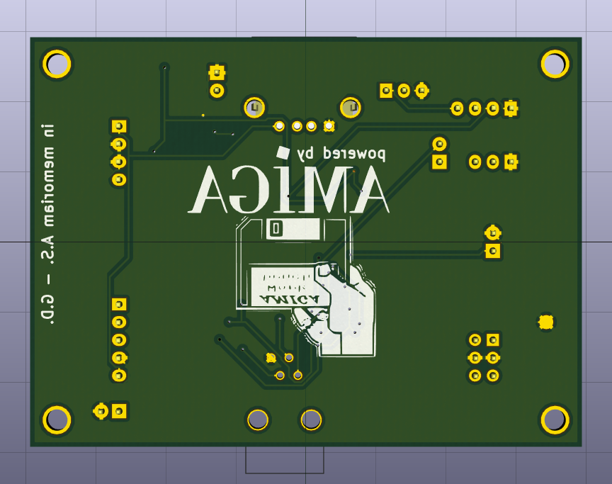
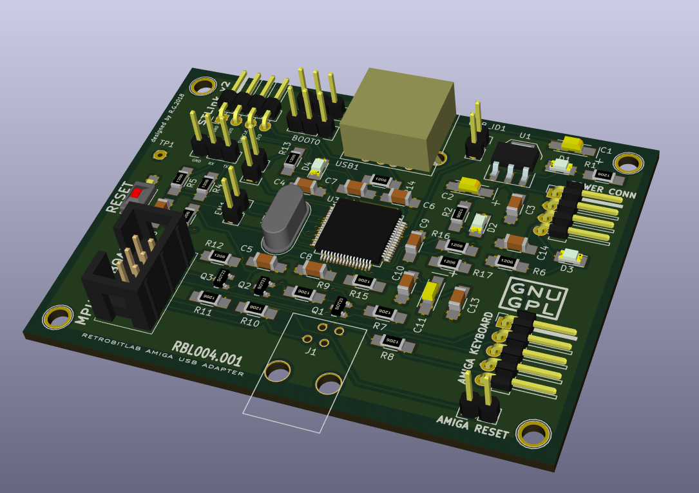

STm32-to-Amiga-Local-Keyboard adaptER
=====================================

The STALKER adapter board enables connecting USB HID keyboards to your Amiga 1000, Amiga 2000/3000, Amiga 4000/CD32, Amiga 500, Amiga 1200 and Amiga 600 and it is based upon 32-bit STM32 microcontroller.

The STALKER provides built-in USB stack which enables USB HID keyboards support without the need for installing additional AmigaOS software drivers. The whole installation process comes down to simply connecting a STALKER adapter and plug to the keyboard port of your Amiga 1000, 2000 or 4000 externally, or internally in any other Amiga computers.

Additional feature of the adapter is its „Bootloader” function allowing future firmware upgrades.
The STALKER comes with dedicated firmware, but it can be easily installed any firmware version as it's an open source project.

Features
========

* supports for both USB HID, wireless adapters and USB-PS/2 keyboards,
* Amiga 1000, 2000/3000, Amiga 4000/CD32, Amiga 1200, Amiga 600 and Amiga 500 compatibility,
* built-in USB stack with HID Keyboard firmware driver
* "Bootloader" function allowing future firmware upgrades,
* "Status" indicator LED providing information about device's state,
* built around 32-bit STM32 microcontroller utilizing latest technology,
* non-blocking keyboard.

Why so a bad name for a so good product?

As stated in the title, the STALKER is an acronym of:

STm32-to-Amiga-Local-Keyboard adaptER
-------------------------------------

But if you think a little more, it is catching all the keystrokes you do,

so basically it is stalking you! ;-)

# Rendered Images
# 
# 
# 

Upgrading quick guide
---------------------
First, get your own copy of STM32CubeProgrammer software.
It is free to use, please checkout the STMicroElectronics web site and install it into your PC.
Please have a look at the following web link: https://www.st.com/en/development-tools/stm32cubeprog.html

After launched it will be shown as the following image.

Connect the special upgrade cable to the right lower opening of the STALKER, the connect the board with the provided USB cable to the one of the USB ports available in your computer. The red LED will light steady.
Then click on the connect button on the upper right position of the STM32Cube Programmer's window as shown in the picture below:

Some information will be shown into the right bottom side of the same window, plus the memory locations will be filled up by the programmed values.

After, you will need to select the correct <b>FIRMWARE</b> file (<b>.hex file format</b>) clicking into the <b>Open File</b> tab button like in the following example:

If the file is loaded correctly, the Download button need to be pressed to start the programming/flashing procedure. It will takes few seconds to be completed.

The firmware is correctly installed into the board, and it can be used as usual.

Now you can:

* Disconnect the board from USB from your PC
* Remove the special ugrade cable
* Re-install the board into your Amiga Computer's setup.
* Connect a USB Keyboard, and turn on the Amiga Computer.

That's all folks!

Software & Hardware License
---------------------------
Copyright (C) 2018/2019/2022 Gianluca Renzi <gianlucarenzi@eurek.it> <icjtqr@gmail.com>

The hardware of this project is released as free/open hardware under the
GNU GPL v3 License terms. See licence.txt for details.

