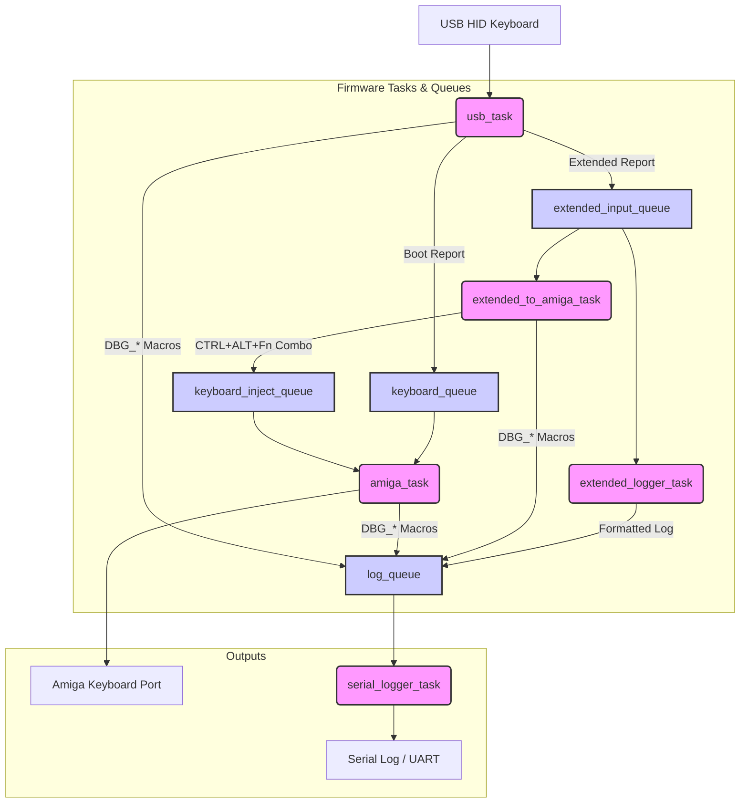
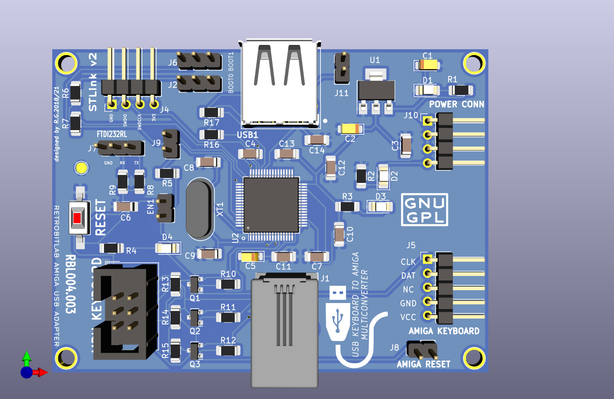
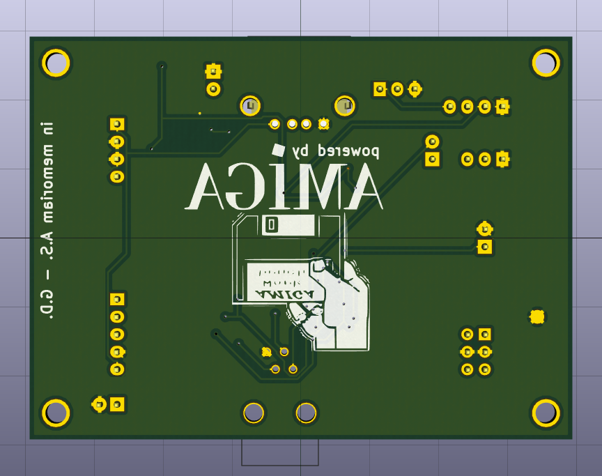
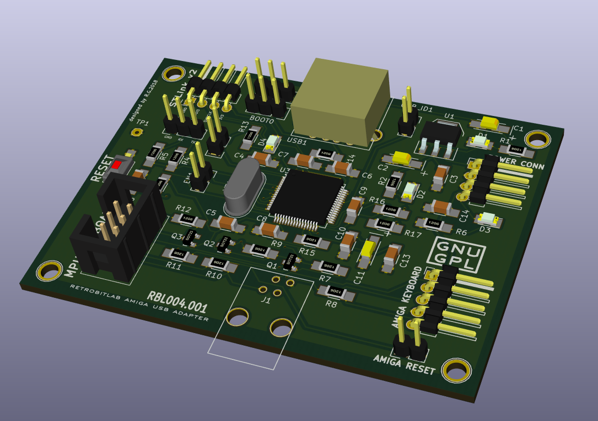

# STm32-to-Amiga-Local-Keyboard adaptER (STALKER)
=================================================

The STALKER adapter board enables connecting modern USB HID keyboards to your classic Amiga computers, including the Amiga 1000, 2000, 3000, 4000, CD32, 500, 600, and 1200. It is based on a 32-bit STM32 microcontroller.

The adapter provides a built-in USB stack that supports USB HID keyboards out of the box, without requiring any additional AmigaOS software drivers. The installation process is as simple as connecting the STALKER adapter to the keyboard port of your Amiga.

An additional feature of the adapter is its "Bootloader" function, allowing for future firmware upgrades.

## Hardware Features
*   Supports both wired USB HID and wireless keyboards (via their USB dongles).
*   Compatible with Amiga 1000, 2000, 3000, 4000, CD32, 500, 600, and 1200.
*   Built-in USB stack with a custom HID Keyboard firmware driver.
*   "Bootloader" function for easy firmware upgrades.
*   "Status" indicator LED providing information about the device's state.
*   Built around a modern 32-bit STM32 microcontroller.
*   Non-blocking keyboard operation.

## Software Features
*   **Real-Time Operating System**: Built on FreeRTOS for robust, real-time performance and task management.
*   **Extended HID Support**: The firmware first attempts to operate in **Boot Protocol** for broader compatibility. If the Boot Protocol is not supported, it falls back to **Report Protocol**, allowing it to parse detailed HID report descriptors. This enables support for keys beyond the standard boot keyboard, such as multimedia and system control keys (e.g., Volume, Mute, Play/Pause).
*   **Advanced Key Mapping**:
    *   Standard USB scancodes are translated to Amiga scancodes on the fly.
    *   Extended HID events (e.g., from the Consumer or System usage pages) are mapped to special `CTRL+ALT+Fn` key combinations. This allows an Amiga-side helper application to react to these events.
*   **Runtime Mode Switching**: The adapter's operating mode (Amiga or PC) can be toggled at runtime using the key combination `Left CTRL + Left ALT + Left SHIFT + P`. The selected mode is saved to EEPROM and persists across power cycles.
*   **Asynchronous Logging**: A dedicated logger task handles serial output, preventing other critical tasks (like USB polling or Amiga communication) from being blocked by slow serial writes. Log messages are color-coded by severity for easy debugging.
*   **Modular Architecture**: The firmware is divided into independent tasks for USB handling, Amiga communication, and event processing, communicating via message queues.

## Software Architecture

The firmware uses a multi-tasking architecture powered by FreeRTOS. This design ensures that USB polling, Amiga protocol communication, and other functions run independently and do not block each other.

The main components are:
*   `usb_task`: Handles low-level USB host communication, device enumeration, and HID report polling.
*   `amiga_task`: Manages the Amiga keyboard communication protocol, including sending scancodes and handling reset signals.
*   `extended_to_amiga_task`: A bridge that converts extended HID events into standard key combinations.
*   `serial_logger_task` & `extended_logger_task`: Asynchronous tasks that manage logging to the serial port.

These tasks communicate using queues, which buffer events and data, ensuring smooth, non-blocking operation.

### Flash Memory Layout

The firmware uses a specific memory layout to separate the bootloader, application, and EEPROM emulation data. This ensures that firmware updates do not overwrite the bootloader and that EEPROM data is persistent.

The 256KB flash memory of the STM32F401RC is organized as follows:

<br>

<table width="100%">
  <thead>
    <tr>
      <th>Start Address</th>
      <th>End Address</th>
      <th>Size</th>
      <th>Sector(s)</th>
      <th>Area</th>
    </tr>
  </thead>
  <tbody>
    <tr bgcolor="#e6f2ff">
      <td><code>0x08000000</code></td>
      <td><code>0x08003FFF</code></td>
      <td>16 KB</td>
      <td>0</td>
      <td><strong>Bootloader</strong></td>
    </tr>
    <tr bgcolor="#ffffcc">
      <td><code>0x08004000</code></td>
      <td><code>0x08007FFF</code></td>
      <td>16 KB</td>
      <td>1</td>
      <td><strong>EEPROM Emulation</strong></td>
    </tr>
    <tr bgcolor="#e6ffe6">
      <td><code>0x08008000</code></td>
      <td><code>0x0803FFFF</code></td>
      <td>224 KB</td>
      <td>2-5</td>
      <td><strong>Application Code</strong></td>
    </tr>
  </tbody>
</table>

<br>

*   **Bootloader**: A 16KB section reserved for the bootloader, which allows for firmware updates.
*   **EEPROM Emulation**: A 16KB flash sector dedicated to emulating EEPROM. This stores persistent settings, such as the current operating mode (Amiga/PC).
*   **Application Code**: The main firmware, including FreeRTOS, USB stack, and keyboard handling logic.

### Data Flow Diagram

The following diagram illustrates how keyboard events flow through the system:


```mermaid
graph TD
    A[USB HID Keyboard] --> B(usb_task)

    subgraph "Firmware Tasks & Queues"
        B -- Boot Report --> E[keyboard_queue]
        B -- Extended Report --> D[extended_input_queue]

        D --> F(extended_logger_task)
        D --> G(extended_to_amiga_task)

        G -- "CTRL+ALT+Fn Combo" --> H[keyboard_inject_queue]

        E --> I(amiga_task)
        H --> I

        F -- Formatted Log --> K[log_queue]
        G -- DBG_* Macros --> K
        I -- DBG_* Macros --> K
        B -- DBG_* Macros --> K
    end

    subgraph "Outputs"
        I --> L[Amiga Keyboard Port]
        K --> J(serial_logger_task) --> M[Serial Log / UART]
    end

    classDef task fill:#f9f,stroke:#333,stroke-width:2px;
    classDef queue fill:#ccf,stroke:#333,stroke-width:2px;
    class B,F,G,I,J task;
    class D,E,H,K queue;
```

For more details on the extended HID mapping, see [HID_EXTENDED_MAPPING.md](HID_EXTENDED_MAPPING.md).

## Why so a bad name for a so good product?

As stated in the title, the STALKER is an acronym of:

**ST**m32-to-**A**miga-**L**ocal-**K**eyboard adapt**ER**
-------------------------------------

But if you think a little more, it is catching all the keystrokes you do, so basically it is stalking you! ;-)

## Rendered Images
[](#features)
[](#features)
[](#features)

## Upgrading with Linux and OpenOCD and STLinkV2 Programmer/Debugger
Starting from this project folder, there are some shell scripts
that can be used to program the board if you unluckly brick it or simply to upgrade
some features from bootloader and application without using the STM32CubeProgrammer software.

Connect the [STLinkV2 jtag/swd programmer](https://it.aliexpress.com/item/1005005293861493.html) to the STALKER Board in J4 connector (STLink V2 in the silkscreen) using a standard 10 pin IDC female/female [cable 2x5 10P](https://it.aliexpress.com/item/1005003161799870.html).
Opening the project folder, you can compile all projects (application and bootloader) running:
```bash
make clean
make
```

### Debugging Features
To enable specific debugging features, you can pass flags to the `make` command:

*   **`DEBUG_USB_FLAG=1`**: Enables a visual indicator (LED toggle) on the status LED every time a USB interrupt is triggered. This is useful for low-level debugging of USB connection issues. Example: `make DEBUG_USB_FLAG=1`

and then launch the corresponding script:

*   `bootloader.sh` (to erase all the flash memory and program the bootloader)
*   `flash.sh` (to program the application, after having erased all needed flash sectors)

## Upgrading quick guide
First, get your own copy of STM32CubeProgrammer software.
It is free to use, please checkout the STMicroElectronics web site and install it into your PC.
Please have a look at the following web link: https://www.st.com/en/development-tools/stm32cubeprog.html

After launched it will be shown as the following image.


Connect the **special upgrade cable** to the right lower opening of **The STALKER**, then connect the board with the provided USB cable to the one of the USB ports available in your computer. The red LED will light steady.

Then click on the connect button on the upper right position of the STM32Cube Programmer's window as shown in the picture below:


Some information will be shown into the right bottom side of the same window, plus the memory locations will be filled up by the programmed values.


After, you will need to select the correct **FIRMWARE** file (**.hex file format**) clicking into the **Open File** tab button like in the following example:


If the file is loaded correctly, the **Download button** needs to be pressed to start the programming/flashing procedure. It will takes few seconds to be completed.


The firmware is correctly installed into the board, and it can be used as usual.


Now you can:

*   Disconnect the board from USB from your PC
*   Remove the special ugrade cable
*   Re-install the board into your Amiga Computer's setup.
*   Connect a USB Keyboard, and turn on the Amiga Computer.

That's all folks!

## Software & Hardware License
Copyright (C) 2018-2025 Gianluca Renzi <gianlucarenzi@eurek.it>

The hardware and software of this project are released as free/open source under the
GNU GPL v3 License terms. See `licence.txt` for details.